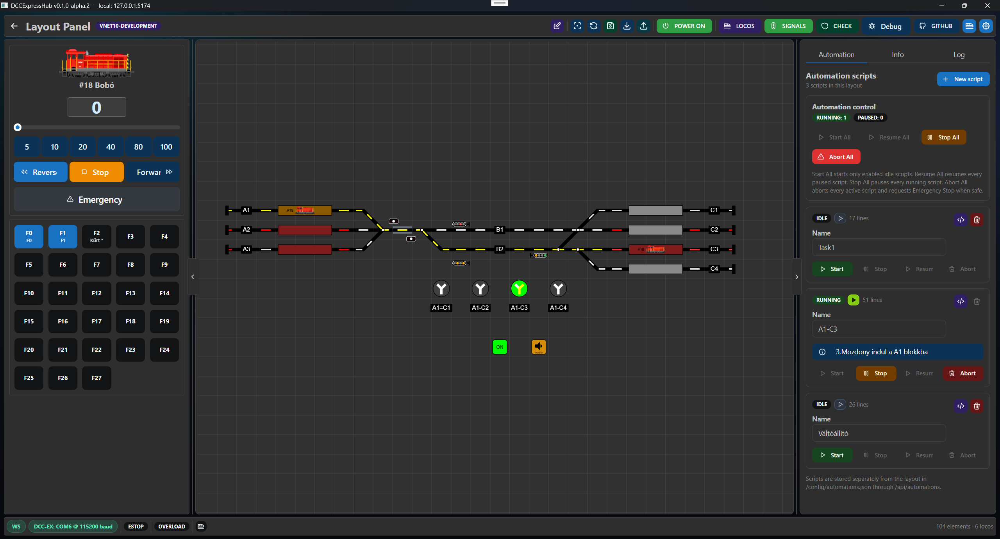

# DCCExpressHub

DCCExpressHub is a control, automation and integration server for **DCC-EX** model railway command stations.

It can run on either a **Windows PC** or a supported **ESP32** device. In both cases DCCExpressHub can act as the layout server, hosting the Web UI and runtime services so the railway can be controlled from multiple devices such as PCs, notebooks, tablets and phones on the local network.

- **Windows Desktop / Server** — runs directly on a Windows PC and can be used locally or as a network server for other devices. The Windows version can connect to a DCC-EX command station over **TCP/IP** (for example an EX-CSB1 on the network) or through a **Serial / USB COM port** (for example an Arduino-based DCC-EX command station).
- **ESP32 Hub** — runs as a standalone embedded server on a supported ESP32 device and provides the same browser-based control interface to PCs, tablets and phones. The ESP32 version currently connects to the DCC-EX command station over **TCP/IP**.

> **DCCExpressHub is not a command station.**
>
> The connected DCC-EX command station still generates the DCC signal. DCCExpressHub provides the user interface, configuration, automation and integration layer around it.



```text
                    DCCExpressHub
                         |
              +----------+----------+
              |                     |
              v                     v
       Windows Desktop          ESP32 Hub
              |                     |
              +----------+----------+
                         |
                      DCC-EX
                         |
                         v
                  Command station
                         |
                        DCC
                         |
                         v
                Model railway layout
```

## Features

Current functionality includes:

- locomotive control, locomotive editor and function control,
- responsive control interface for PC, tablet and mobile,
- layout editor and runtime layout operation,
- turnouts, accessories, signals and signal logic,
- occupancy / sensor integration,
- decoder programming,
- automation scripts,
- track power and emergency control,
- DCC-EX connection configuration,
- raw command console and diagnostics,
- gamepad support,
- external device configuration,
- file management on supported embedded targets,
- SD-card storage and audio playback on M5Stack Basic,
- Export / Import backup,
- browser-based ESP32 firmware installation,
- USB serial configuration and recovery for ESP32 targets,
- Windows Desktop application with integrated server log.

# Windows Desktop

DCCExpressHub can run directly on a Windows PC without a separate ESP32 Hub.

## Download and install

Download the Windows package from the official GitHub Releases page:

https://github.com/DCCExpress/DCCExpressHub/releases

The Windows release package is named:

```text
DCCExpressHub-<version>-win-x64.zip
```

### 1. Download the ZIP

Download the `win-x64` ZIP from the release you want to use.

### 2. Unblock the downloaded ZIP if Windows marked it as an Internet download

Windows may attach an Internet security mark to downloaded ZIP files. It is best to remove this **before extracting the archive**.

1. Right-click the downloaded ZIP.
2. Select **Properties**.
3. On the **General** tab, look for **Unblock** near the bottom of the window.
4. Enable **Unblock**.
5. Click **Apply** and **OK**.

If the **Unblock** option is not shown, no action is required.

If you already extracted the ZIP and Windows blocks the application, you can check the properties of `DCCExpressHub.Desktop.exe` and unblock it there.

### 3. Extract the ZIP

Extract the complete ZIP to a normal writable directory, for example:

```text
C:\DCCExpressHub
```

or:

```text
C:\Users\<your-name>\Documents\DCCExpressHub
```

Do not run the application directly from inside the ZIP archive.

### 4. Start DCCExpressHub

Run:

```text
DCCExpressHub.Desktop.exe
```

The startup window lets you configure:

- DCC-EX connection type:
  - TCP
  - Serial / USB COM port
- DCC-EX address or COM port,
- Local or Server mode,
- Hub HTTP port,
- persistent workspace directory.

The default Desktop Hub HTTP port is:

```text
5174
```

### 5. Windows SmartScreen

DCCExpressHub releases may not yet be digitally signed.

Because of this, Microsoft Defender SmartScreen may warn about an unknown publisher.

If this happens, first make sure the ZIP was downloaded from the official DCCExpressHub GitHub Releases page. You can then use **More info -> Run anyway** to start the application.

## Local and Server mode

### Local mode

```text
127.0.0.1:5174
```

The Hub is available only on the Windows PC running DCCExpressHub.

This is the recommended mode when the Desktop application is the only control interface you need.

### Server mode

In Server mode DCCExpressHub also listens on the local network.

This allows other devices such as tablets, phones or notebooks to open the Hub using the Windows PC's LAN IP address.

Example:

```text
http://192.168.1.100:5174
```

Use Server mode only on a trusted local network.

## Windows requirements

The published Windows package is **self-contained**. You do not need to install the .NET SDK or .NET Runtime separately.

DCCExpressHub Desktop uses the **Microsoft Edge WebView2 Runtime** for its embedded browser interface. On most current Windows systems this is already installed together with Microsoft Edge.

If WebView2 Runtime is missing, DCCExpressHub displays a startup error instead of silently failing.

## Persistent workspace

User data is stored outside the application directory in a persistent workspace.

The default workspace is under:

```text
%LOCALAPPDATA%\DCCExpressHub\workspace
```

The workspace contains persistent data such as:

```text
data\
├── config\
├── images\
└── state\
```

This means you can replace or update the application files without deleting the layout and configuration stored in the workspace.

## Closing DCCExpressHub

When closing the Desktop application, DCCExpressHub asks for confirmation and reminds you to save your changes.

The exit dialog can also switch **track power OFF** before shutting down the backend.

## Desktop keyboard shortcuts

| Key | Function |
|---|---|
| **F10** | Show / hide the advanced menu |
| **F11** | Toggle fullscreen |
| **Esc** | Leave fullscreen |

The advanced menu includes **View -> Server Log** for showing or hiding the backend log panel.

# ESP32 Hub

The embedded version runs DCCExpressHub directly on a supported ESP32 device.

The ESP32 Hub serves the control interface itself and communicates with the DCC-EX command station over the local network.

```text
PC / tablet / phone
        |
        | HTTP / WebSocket
        v
 DCCExpressHub ESP32
        |
        | DCC-EX
        v
 Command station
```

## Supported ESP32 targets

Current DCC-EX firmware targets:

| Hub hardware | PlatformIO target | Display support | Frontend automation | Backend automation 
|---|---|---|---|---|
| **M5Stack Basic** | `m5stack-basic-dccex` | ✅ Built-in display | ✅ Supported | ❌ Not supported |
| **Generic ESP32 DevKit** | `esp32dev-dccex` | ❌ None | ✅ Supported | ❌ Not supported |
| **Waveshare ESP32-S3 LCD 7"** | `waveshare-s3-lcd7-dccex` | ✅ Built-in 7" display | ✅ Supported | ✅ Supported |
| **Sunton ESP32-8048S043** | `sunton-8048s043-dccex` | ✅ Built-in 4.3" display | ✅ Supported | ✅ Supported |

**Frontend automation scripts** run in the browser and are available on all current Hub targets.

**Backend automation scripts** run directly on the Hub firmware through the QuickJS-based JavaScript Sandbox. They currently require the ESP32-S3 targets built with `HUB_JS_SANDBOX`.

The current GitHub release workflow publishes merged firmware for:

```text
m5stack-basic-dccex
esp32dev-dccex
```

The Waveshare and Sunton targets are currently available in the source tree and can be built manually.

## Install, configure and recover

The recommended installation method is the DCCExpressHub Web Installer:

https://dccexpress.github.io/DCCExpressHubWeb/installer/

Use desktop **Google Chrome** or **Microsoft Edge**. Firmware installation and serial configuration use ESP Web Tools / Web Serial.

### 1. Select the Hub hardware

Select the exact hardware target supported by the installer or by the firmware file you are flashing.

Official release assets are currently built for **DCC-EX**.

### 2. Install the firmware

Connect the Hub by USB, select the desired firmware release and press **Install firmware**.

The installer flashes a complete merged image at:

```text
0x000000
```

A factory / merged installation may erase existing NVS configuration and stored layout data. Creating an **Export / Import** backup before major updates is recommended.

Depending on the ESP32 board, Windows may require a **CH340/CH341** or **CP210x** USB-UART driver.

For development or recovery, the installer can also flash a local merged `.bin` file.

### 3. Configure the Hub

After flashing, connect through the same web tool over USB serial at:

```text
115200 baud
```

Typical settings:

```text
Hub hostname:     dccexpresshub
Browser URL:      http://dccexpresshub.local

DCC-EX host:      dccex.local
DCC-EX TCP port:  2560
```

An IPv4 address can be used instead of an mDNS hostname.

The serial recovery path works even when saved Wi-Fi or command-station settings are incorrect.

Once configured, open:

```text
http://dccexpresshub.local
```

On a fresh installation, use **Locomotive editor** and **Layout editor**, or restore a previous installation through **Export / Import**.

## Serial recovery commands

The firmware accepts both the installer JSON protocol and human-readable commands:

```text
<STATUS?>                         Show Hub, Wi-Fi and command-station status
<WIFI?>                           Show stored Wi-Fi configuration
<WIFI "ssid" "password">          Save Wi-Fi credentials
<DCCEX?>                          Show DCC-EX endpoint and connection state
<DCCEX "dccex.local" 2560>        Set DCC-EX host and TCP port
<RESTART>                         Restart the Hub
<HELP?>                           Show available serial commands
```

Examples:

```text
<STATUS?>
<DCCEX "192.168.1.143" 2560>
<WIFI "MyWiFi" "MyPassword">
<RESTART>
```

`<WIFI ...>` requires a restart. DCC-EX endpoint changes are applied immediately.

Because `<WIFI?>` and `<STATUS?>` are intended for **physical USB recovery**, they may expose the stored Wi-Fi password. Treat physical serial access as trusted access.

# Command-station support

DCCExpressHub is designed first and foremost for **DCC-EX / EX-CSB1**.

DCC-EX is the current priority, reference implementation and officially supported command-station backend.

**Roco/Fleischmann Z21 LAN support is planned for a future release.** Experimental Z21 implementation remains in the source tree, but Z21 is not currently an officially supported target and no Z21 firmware is published in DCCExpressHub releases.

# S88 / s88-N feedback

DCCExpressHub can use S88 / s88-N occupancy feedback with the companion **DCCExpress-S88Adapter** project.

The current adapter implementation has been tested with the **YaMoRC YD6016ES-CS**.

Project repository:

https://github.com/DCCExpress/DCCExpress-S88Adapter

There are currently two integration paths in the repository.

## Hub-side adapter integration

The ESP32 Hub contains S88 adapter/device configuration support and can read supported adapter data over I2C on configured hardware.

## DCC-EX HAL integration

The repository also contains a DCC-EX HAL driver under:

```text
dcc-ex/
├── IO_DCCExpressS88.h
├── myHal.example.cpp
└── sensors-1001-1032.txt
```

This allows the S88 adapter to appear to DCC-EX as ordinary VPIN inputs. Standard DCC-EX Sensor objects can then emit normal `<Q>` / `<q>` sensor messages, so DCCExpressHub does not need an S88-specific protocol for that path.

Example:

```cpp
#include "IO_DCCExpressS88.h"

void halSetup() {
    DCCExpressS88::create(1001, 32, 0x30);
}
```

Mapping:

```text
S88 input 1  -> VPIN 1001
S88 input 2  -> VPIN 1002
...
S88 input 32 -> VPIN 1032
```

See `dcc-ex/README.md` for the integration details.

# M5Stack SD card and audio

The **M5Stack Basic** can use its built-in microSD slot for larger user files such as locomotive sounds and announcements.

Recommended card format:

```text
File system:          FAT32
Allocation unit size: 32 KB
Volume label:         DCCEXPRESS (optional)
```

**FAT32 is recommended. Do not use NTFS.** Large SDXC cards may need to be reformatted from exFAT to FAT32.

After a successful SD mount, the Hub automatically ensures this directory exists:

```text
/audio
```

Recommended layout:

```text
SD Card
└── audio
    ├── horn.mp3
    ├── station.mp3
    ├── crossing.mp3
    └── mav_signal.mp3
```

MP3 is recommended. The browser performs audio decoding; the ESP32 streams the file from the SD card.

Upload sounds from:

```text
Files / File Manager
-> SD Card
-> audio
```

Virtual Hub paths look like:

```text
/sd/audio/mav_signal.mp3
```

To use a sound on the layout:

1. Open **Layout editor**.
2. Add an **Audio Button**.
3. Set its label.
4. Select a file from `/audio`.
5. Use **Play / Test** if needed.
6. Save the layout.

Large audio files should be stored on SD rather than LittleFS.

# PC, tablet and mobile use

DCCExpressHub can be controlled from a desktop PC, notebook, tablet or phone using a modern browser when either:

- an ESP32 Hub is running, or
- Windows Desktop is running in **Server mode**.

For a permanently mounted Android tablet, a fullscreen / kiosk browser such as **Fully Kiosk Browser** is useful.

On iPhone/iPad, Safari works normally and Guided Access can be used for a dedicated control device.

# Build and development

The sections below are intended for contributors and developers. Normal Windows Desktop users do not need Node.js, the .NET SDK, PlatformIO or the source repository.

## Architecture

The project currently has two runtime targets sharing the same frontend:

```text
                         React WebUI
                  TypeScript + Mantine + Vite
                                |
                  +-------------+-------------+
                  |                           |
                  v                           v
             ESP32 Hub                 Windows Desktop
        LittleFS / HTTP / WS        ASP.NET Core backend
                                          +
                                      WPF/WebView2
                  |                           |
                  +-------------+-------------+
                                |
                         DCC-EX protocol
```

Repository implementation:

- **Frontend:** React + Mantine + TypeScript + Vite
- **ESP32 backend:** Arduino / PlatformIO
- **Windows backend:** .NET 10 / ASP.NET Core
- **Windows shell:** WPF + Microsoft WebView2

## Development requirements

For ESP32 development:

- Node.js / npm
- PlatformIO
- ESP32 PlatformIO toolchain

For Windows Desktop development:

- Node.js / npm
- .NET 10 SDK
- Microsoft Edge WebView2 Runtime
- Visual Studio 2026 optional

Clone:

```bash
git clone https://github.com/DCCExpress/DCCExpressHub.git
cd DCCExpressHub
```

## ESP32 WebUI / LittleFS build

Build the shared WebUI and prepare the ESP32 LittleFS data:

```powershell
.\build-web.ps1
```

This builds:

```text
web-ui\dist
```

and then prepares the firmware `data/` directory.

## ESP32 merged firmware

Build an official DCC-EX target:

```powershell
.\build-merged.ps1 -Environment m5stack-basic-dccex
.\build-merged.ps1 -Environment esp32dev-dccex
.\build-merged.ps1 -Environment waveshare-s3-lcd7-dccex
.\build-merged.ps1 -Environment sunton-8048s043-dccex
```

Merged firmware is written to:

```text
dist\firmware
```

## Windows Desktop development build

Normal development build:

```powershell
.\build-desktop.ps1
```

Explicit Release build:

```powershell
.\build-desktop.ps1 -Configuration Release
```

The script:

- builds the frontend,
- refreshes `desktop\DCCExpressHub.Net\wwwroot`,
- verifies the generated frontend files,
- builds the Windows Desktop solution.

## Windows release package

Create a clean Windows release package with:

```powershell
.\build-desktop.ps1 -Clean -Publish
```

`-Publish` uses the release publishing flow and creates a self-contained Windows x64 package:

```text
dist\desktop\DCCExpressHub-<VERSION>-win-x64.zip
```

The package contains the Desktop shell, backend and frontend runtime files needed by DCCExpressHub.

The release publish uses single-file executables where possible and removes development-only symbols and WebView2 XML API documentation from the distributable ZIP.

The package version is read from the repository-root:

```text
VERSION
```

## WebUI development

The frontend is **React + Mantine + TypeScript + Vite** and is shared by the embedded and Windows targets.

Against a real Hub:

```powershell
cd web-ui
npm install
$env:DCCEXPRESS_DEVICE_URL="http://dccexpresshub.local"
npm run dev
```

The Vite development server uses:

```text
http://localhost:5173
```

The Windows Desktop Hub uses port `5174` by default, so the Vite development server and Desktop backend do not collide.

To develop against Windows Desktop instead:

```powershell
$env:DCCEXPRESS_DEVICE_URL="http://127.0.0.1:5174"
npm run dev
```

For frontend work without physical hardware, the repository provides a demo mode:

```powershell
cd web-ui
npm run dev:demo
```

Demo mode prepares its demo seed data and starts Vite without proxying requests to a physical Hub.

# Versioning and releases

The repository-root `VERSION` file is the single source of truth for the project release version.

Example:

```text
0.1.0-alpha.2
```

Create an official firmware release with:

```powershell
.\release.ps1 0.1.0-alpha.2
```

The release helper:

- updates `VERSION`,
- synchronizes the WebUI npm package version,
- creates a release commit,
- creates the matching annotated Git tag,
- pushes the branch and tag,
- starts the GitHub Actions release workflow.

The workflow refuses to publish if the Git tag and `VERSION` do not match.

The current GitHub release workflow publishes merged firmware for:

```text
m5stack-basic-dccex
esp32dev-dccex
```

Additional DCC-EX source targets currently available in `platformio.ini` include:

```text
waveshare-s3-lcd7-dccex
sunton-8048s043-dccex
```

Z21 remains a future-development target and is not included in official release assets.

# Repository structure

```text
DCCExpressHub/
├── src/                         ESP32 firmware
├── include/                     firmware headers / defaults
├── web-ui/                      shared React + Mantine frontend
├── desktop/                     Windows native runtime
│   ├── DCCExpressHub.Net/       .NET 10 Hub backend + committed wwwroot
│   ├── DCCExpressHub.Desktop/   WPF + WebView2 shell
│   └── DCCExpressHub.Desktop.slnx
├── dcc-ex/                      DCC-EX HAL integrations
├── data/                        prepared ESP32 LittleFS content
├── tools/firmware/              merged firmware tools
├── platformio.ini               ESP32 hardware / command-station targets
├── VERSION                      release version source
├── release.ps1                  firmware release helper
├── build-web.ps1                WebUI + ESP32 LittleFS preparation
├── build-desktop.ps1            Windows Desktop build / publish
├── build-merged.ps1
└── build-all-merged.ps1
```

The ESP32 firmware remains at the repository root (`src/`, `include/`, `platformio.ini`).

The native Windows implementation lives under `desktop/`.

Both targets share `web-ui/`.

# Project status and links

DCCExpressHub is under active **alpha development**. Interfaces, hardware support, Desktop support and command-station backends may change while the project evolves.

Project website:

https://dccexpress.github.io/DCCExpressHubWeb/

GitHub Releases:

https://github.com/DCCExpress/DCCExpressHub/releases

ESP32 Web Installer:

https://dccexpress.github.io/DCCExpressHubWeb/installer/

DCC-EX:

https://dcc-ex.com/

Related website / installer repository:

https://github.com/DCCExpress/DCCExpressHubWeb

S88 adapter:

https://github.com/DCCExpress/DCCExpress-S88Adapter

# License

See the repository license for the current project licensing terms.
