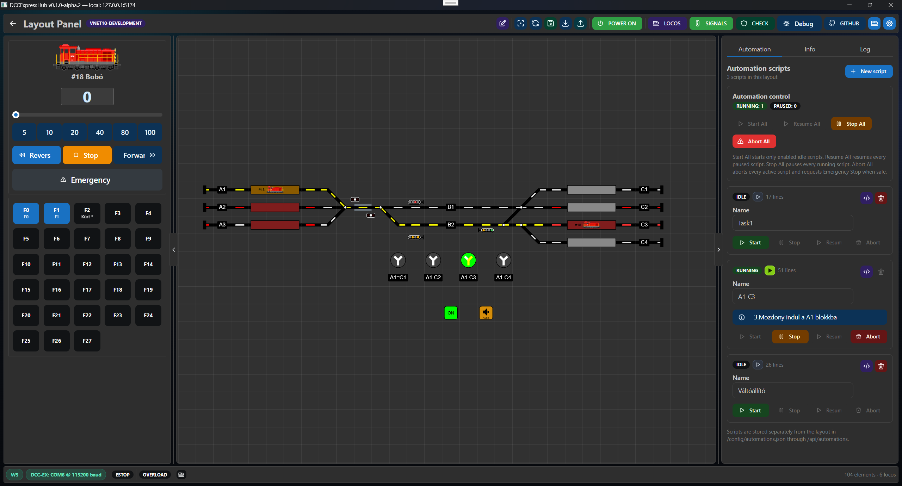

# DCCExpressHub

DCCExpressHub is a control, layout and automation system for model railways using **DCC-EX**, **Roco Z21** or **YaMoRC YD7010** command stations.

It provides one interface for driving locomotives, programming decoder CVs, operating turnouts and signals, editing the layout, following trains, running automatic movements and timetables, and using occupancy sensors for safer operation.

DCCExpressHub runs on:

- **Windows** — packaged desktop application with WPF + WebView2 and the native .NET backend.
- **Linux** — the same .NET 10 backend runs headless and serves the browser UI over HTTP/WebSocket.

The browser interface can be opened from PCs, notebooks, tablets and phones on the local network.

> **DCCExpressHub is not a command station.**
>
> The connected command station still generates the DCC track signal. DCCExpressHub sits above it and provides the control, layout, tracking and automation functions.



## How it works

```text
 PC / tablet / phone
         |
      HTTP / WS
         |
         v
   DCCExpressHub
  Windows or Linux
         |
  TCP / USB / UDP
         |
         v
  Command station
 DCC-EX / Z21 / YD7010
         |
         v
 Model railway layout
```

## Features

DCCExpressHub provides a browser-based interface for:

- locomotive, function, turnout and signal control,
- decoder CV programming,
- visual layout editing,
- occupancy sensing and train tracking,
- route planning and automatic train movements,
- timetable operation,
- visual Flows and JavaScript automation,
- audio and event-driven actions,
- multi-client operation from PCs, tablets and phones.

Automation runs in the .NET backend, so connected browsers share the same
layout and runtime state.

## Command station support

| Command station | Windows | Linux |
| --- | --- | --- |
| DCC-EX TCP | Supported | Supported |
| DCC-EX Serial / USB | Supported | Supported |
| Roco Z21 | Supported | Supported |
| YaMoRC YD7010 | Supported | Supported |

### DCC-EX

DCC-EX is supported over TCP/IP and USB/serial.

S88 / s88-N feedback can be added to a DCC-EX command station with the
**DCCExpress-S88Adapter**:

https://github.com/DCCExpress/DCCExpress-S88Adapter

The adapter repository contains the complete Arduino and DCC-EX integration
instructions.

### Roco Z21

Roco Z21 is supported through the native Z21 LAN protocol for locomotive,
turnout, signal, power and feedback handling.

### YaMoRC YD7010

YaMoRC YD7010 is supported with separate protocol paths for control and
feedback:

```text
Z21      -> locomotive / turnout / signal / power
LocoNet  -> occupancy / feedback
```

The Z21 and LocoNet implementations remain separate inside DCCExpressHub even
when both connect to the same YD7010.

## Architecture

The primary runtime is the cross-platform **DCCExpressHub.Net** backend:

```text
                    Browser UI
                        |
                   HTTP + WS
                        |
                        v
                DCCExpressHub.Net
               .NET 10 + Watson 7
                        |
        +---------------+---------------+
        |               |               |
      DCC-EX           Z21           LocoNet
        |               |               |
        +---------------+---------------+
                        |
                 Model railway
```

The backend owns:

- command-center communication,
- layout runtime state,
- Movement/Dispatcher,
- train tracking,
- Flows,
- JavaScript Scripts,
- Timetable,
- fast clock,
- file storage,
- WebSocket runtime synchronization.

The React UI is a client of the backend and does not execute the automation engines.

# Windows

## Windows requirements

For the published Windows package:

- Windows 10 or Windows 11 x64,
- Microsoft Edge WebView2 Runtime,
- LAN/USB access to the selected command station.

The release package contains the required .NET runtime and does not require a separate .NET SDK installation.

## Windows installation

Download the current Windows release from:

https://github.com/DCCExpress/DCCExpressHub/releases

The package is typically named:

```text
DCCExpressHub-<version>-win-x64.zip
```

Extract the complete archive to a writable directory and run:

```text
DCCExpressHub.Desktop.exe
```

Do not run the application directly from inside the ZIP archive.

### Windows SmartScreen

Alpha builds may not be digitally signed.

If Microsoft Defender SmartScreen reports an unknown publisher, verify that the package was downloaded from the official DCCExpressHub GitHub Releases page.

## Windows Local mode

The Desktop application can run the Hub only for the local PC.

Default URL:

```text
http://127.0.0.1:5174
```

## Windows Server mode

Server mode exposes DCCExpressHub to the trusted local network.

Example:

```text
http://192.168.1.100:5174
```

Other PCs, tablets and phones can then open the same layout in a modern browser.

## Windows persistent workspace

The Desktop application keeps runtime data outside the application directory.

Default location:

```text
%LOCALAPPDATA%\DCCExpressHub\workspace
```

This includes layout/configuration/state data and keeps user data separate from the installed binaries.

## Building on Windows from source

Requirements:

- Git,
- Node.js **^20.19.0 or >=22.12.0**,
- npm,
- .NET 10 SDK,
- Microsoft Edge WebView2 Runtime,
- PowerShell,
- Visual Studio 2022/2026 optional.

Clone:

```powershell
git clone https://github.com/DCCExpress/DCCExpressHub.git
cd DCCExpressHub
```

Build the Web UI and Windows Desktop application:

```powershell
.\build-desktop.ps1
```

Release configuration:

```powershell
.\build-desktop.ps1 -Configuration Release
```

Create the self-contained Windows x64 release package:

```powershell
.\build-desktop.ps1 -Clean -Publish
```

The generated ZIP is written under:

```text
dist\desktop
```

The build script performs:

```text
web-ui
   |
npm build
   |
web-ui/dist
   |
sync
   |
desktop/DCCExpressHub.Net/wwwroot
   |
.NET backend + WPF Desktop build
```

# Linux

DCCExpressHub runs natively on Linux as a headless .NET backend.

There is currently no packaged Linux release. Linux installations are built directly from the Git repository.

The UI is served by the backend and is opened in a browser.

## Linux requirements

Required:

- x64 or ARM64 Linux,
- .NET 10 SDK,
- Git,
- Node.js **^20.19.0 or >=22.12.0**,
- npm.

Tested development environment:

```text
Debian GNU/Linux 12 (bookworm)
linux-x64
.NET 10
```

For DCC-EX USB/serial, the Linux user must also have permission to access the serial device.

On Debian-based systems this commonly means membership in the `dialout` group:

```bash
sudo usermod -aG dialout $USER
```

Log out and back in after changing group membership.

## Linux installation from Git

Clone:

```bash
git clone https://github.com/DCCExpress/DCCExpressHub.git
cd DCCExpressHub
```

Build everything:

```bash
./run-linux.sh --build
```

Then configure and start:

```bash
./run-linux.sh
```

On the first run the launcher asks which command center to use:

```text
1) YaMoRC YD7010 (Z21 + separate LocoNet)
2) Roco Z21
3) DCC-EX TCP
4) DCC-EX Serial
```

The machine-local settings are stored in:

```text
desktop/DCCExpressHub.Net/.env.linux
```

The file is ignored by Git.

## Linux Web UI build

A source checkout contains the React/Vite UI under:

```text
web-ui/
```

The Linux launcher builds it using:

```bash
npm ci
npm run build
```

Production output:

```text
web-ui/dist/
```

Watson serves this directory directly. No manual copy into the backend is required.

A normal:

```bash
git pull
./run-linux.sh
```

automatically rebuilds the UI if the checked-out `web-ui` source tree changed.

Useful launcher commands:

```bash
./run-linux.sh --build          # build UI and backend
./run-linux.sh --build-ui       # build only React/Vite UI
./run-linux.sh --build-backend  # build only .NET backend
./run-linux.sh --configure      # change command-center settings and start
./run-linux.sh --show           # show saved Linux configuration
./run-linux.sh --help
```

## Linux backend URL

The default listen address is:

```text
http://0.0.0.0:5174
```

Open it from another machine using the Linux host's LAN address, for example:

```text
http://192.168.1.50:5174
```

The listen URL can be overridden with:

```bash
export DCCEXPRESS_HTTP_URL=http://0.0.0.0:5174
```

## Linux manual build

The launcher is recommended, but the components can also be built manually.

Web UI:

```bash
cd web-ui
npm ci
npm run build
cd ..
```

Backend:

```bash
dotnet restore desktop/DCCExpressHub.Net/DCCExpressHub.Net.csproj
dotnet build desktop/DCCExpressHub.Net/DCCExpressHub.Net.csproj
```

Run manually:

```bash
export DCCEXPRESS_CONTENT_ROOT="$PWD/desktop/DCCExpressHub.Net"
export DCCEXPRESS_WEB_ROOT="$PWD/web-ui/dist"
export DCCEXPRESS_HTTP_URL=http://0.0.0.0:5174

dotnet run --project desktop/DCCExpressHub.Net/DCCExpressHub.Net.csproj
```

For normal use, `run-linux.sh` is easier because it also manages command-center configuration.

## Linux publish examples

Framework-dependent x64:

```bash
dotnet publish desktop/DCCExpressHub.Net/DCCExpressHub.Net.csproj \
  -c Release \
  -r linux-x64 \
  --self-contained false
```

Framework-dependent ARM64:

```bash
dotnet publish desktop/DCCExpressHub.Net/DCCExpressHub.Net.csproj \
  -c Release \
  -r linux-arm64 \
  --self-contained false
```

## macOS

The .NET backend is intentionally written using cross-platform APIs, but macOS is **not currently an officially tested or supported DCCExpressHub platform**.

There is no macOS Desktop package or automated macOS build/test process at this time.

# Development

## Web UI development

Start the backend first, then run Vite:

```bash
cd web-ui
npm install
DCCEXPRESS_DEVICE_URL=http://127.0.0.1:5174 npm run dev
```

Vite development server:

```text
http://localhost:5173
```

On PowerShell:

```powershell
cd web-ui
npm install
$env:DCCEXPRESS_DEVICE_URL="http://127.0.0.1:5174"
npm run dev
```

## Repository structure

```text
DCCExpressHub/
├── web-ui/                        React + Vite + Mantine frontend
├── desktop/
│   ├── DCCExpressHub.Net/         cross-platform .NET 10 + Watson backend
│   ├── DCCExpressHub.Desktop/     Windows WPF + WebView2 shell
│   └── DCCExpressHub.Desktop.slnx
├── dcc-ex/                        DCC-EX integrations
├── doc/                           documentation and screenshots
├── run-linux.sh                   Linux build/config/run launcher
├── build-desktop.ps1              Windows build/release script
├── VERSION
└── README.md
```

## Versioning

The repository-root `VERSION` file is the project version source.

Current development version:

```text
0.1.0-alpha.3
```

GitHub Releases:

https://github.com/DCCExpress/DCCExpressHub/releases

Alpha releases are published as pre-releases.

## Project status

DCCExpressHub is under active alpha development.

The **.NET backend is the primary runtime** and runs on Windows and Linux.

The Windows WPF shell provides the packaged desktop application. Linux runs the same backend headlessly and uses the browser UI.

Interfaces, automation behaviour and hardware support may still change while the project evolves.

## Links

Project website:

https://dccexpress.github.io/DCCExpressHubWeb/

GitHub Releases:

https://github.com/DCCExpress/DCCExpressHub/releases

DCC-EX:

https://dcc-ex.com/

S88 adapter:

https://github.com/DCCExpress/DCCExpress-S88Adapter

## License

See the repository license for the current project licensing terms.
