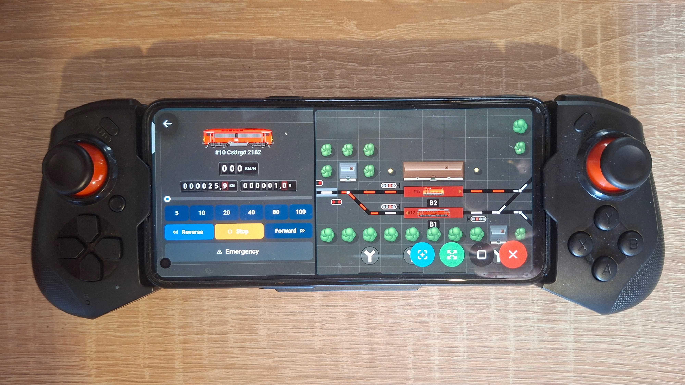

# DCCExpressHub

**Version: 0.1.0-alpha.5**

**DCCExpressHub** is a model railway control and automation application supporting the **DCC-EX**, **Z21 + R-BUS**, and **LocoNet** protocols.

Drive locomotives, operate turnouts and signals, design your track layout, monitor occupancy sensors, and run automatic movements and timetables—all from one interface.

Available for:

- **Windows** — desktop application powered by .NET 10.
- **Linux** — runs as a server, with the interface available in a web browser.

You can also control your railway from a computer, tablet, or phone on the same local network.

> **DCCExpressHub is not a command station.** Your connected command station generates the track signal; DCCExpressHub provides control, layout, and automation on top of it.


## Features

- **Locomotive control** — speed, direction, and functions.
- **Turnouts and signals** — operate accessories from the control panel or track layout.
- **Visual layout editor** — create and manage your model railway track plan.
- **Occupancy and train tracking** — view sensor feedback and locomotive positions.
- **Routes and automatic movements** — plan train movements across your layout.
- **Timetables** — schedule automatic operations.
- **Flows and scripts** — set up event-driven automation.
- **Sound** — use audio announcements and other event-driven actions.
- **Decoder programming** — read and write supported CVs.
- **Gamepad control** — use compatible Bluetooth or USB controllers.
- **Multiple devices** — access the same railway from PCs, tablets, and phones.

### Gamepad control

Use a compatible Bluetooth or USB gamepad with the mobile control interface to drive locomotives, activate functions, stop trains, and operate available layout controls.



Configure button assignments on the **Gamepad** page. Settings are saved for the browser/device you use. Gamepad availability depends on your browser and controller.

## Supported protocols

DCCExpressHub supports three command-center communication profiles on **Windows** and **Linux**. Select the protocol supported by your command station and connect the corresponding interface.

| Protocol / connection | Tested on (command stations) | Feedback | CV programming |
| --- | --- | --- | --- |
| **DCC-EX** — TCP/IP or USB/serial | DCC-EX (including EX-CSB1) | DCC-EX sensor reporting; optional S88 adapter | Service-track CV programming and supported operations-mode programming |
| **Z21 + R-BUS** — LAN/UDP | Roco z21 / Z21; YaMoRC YD7010 in Z21-compatible mode | R-BUS occupancy sensors, with configurable offset | Supported Z21 programming operations (subject to command station capabilities) |
| **LocoNet** — TCP (LBServer) | YaMoRC YD7010 with LocoNet server enabled | LocoNet occupancy feedback (including supported S88 modules), with configurable offset | Native LocoNet service-track CV reading/writing, locomotive POM, and accessory POM writing |

### DCC-EX

Connect to a DCC-EX command station over **TCP/IP** or **USB/serial**. The HUB uses the DCC-EX command protocol for locomotive control, functions, turnouts, sensors, and supported CV programming.

For S88 / s88-N occupancy feedback, see the separate [DCCExpress S88 Adapter](https://github.com/DCCExpress/DCCExpress-S88Adapter) project.

### Z21 + R-BUS

Connect over the **Z21 LAN protocol (UDP)**. This profile supports Roco z21 / Z21 and the **YaMoRC YD7010** in Z21-compatible mode. Locomotive control, functions, turnouts, and accessories use the Z21 interface. Configure **R-BUS feedback** and its sensor offset in the connection settings.

The white z21 supports R-BUS; hardware variants and their available feedback interfaces differ. Do not assume that black Z21 CAN, S88, or LocoNet feedback is exposed through this R-BUS profile.

### Native LocoNet TCP

Connect to the **YaMoRC YD7010 LocoNet LBServer** over TCP (typically port **1234**, depending on configuration). This is a **separate protocol driver**, not an extension of the Z21 UDP driver.

The HUB supports locomotive control and functions, turnouts, basic accessories, extended signal aspects, LocoNet sensor feedback, and native LocoNet CV programming. The Programming page includes the **Decoder Profile** reader. Service-mode programming requires the decoder to be connected to the command station's **isolated programming-track output**. Reading many CVs can take several minutes.

**YaMoRC YD7010:** Choose either **Z21 + R-BUS** or **native LocoNet TCP** according to how you connect and which feedback bus you use. Their connection settings and sensor offsets are independent; do not enable both profiles for one connection unless you intentionally configured a supported arrangement.


## Installation

### Windows

**Requirements:** Windows 10 or 11 (64-bit), Microsoft Edge WebView2 Runtime, and network or USB access to your command station.

1. Open [GitHub Releases](https://github.com/DCCExpress/DCCExpressHub/releases).
2. Download the Windows package: `DCCExpressHub-<version>-win-x64.zip`.
3. Extract the ZIP into a writable folder.
4. Start `DCCExpressHub.Desktop.exe`.
5. Follow the initial setup to choose your command station and connection settings.

The Windows package includes the required .NET runtime. You do **not** need to install the .NET SDK.

Do not launch the application from inside the ZIP file. Alpha releases may be unsigned; if Windows SmartScreen displays a warning, verify the download came from the official Releases page.

Your application data is stored separately from the program files:

```text
%LOCALAPPDATA%\DCCExpressHub\workspace
```

The application can also be made available to other devices on your trusted local network.

### Linux

DCCExpressHub runs on Linux as a server. Open its interface from a browser on the computer or another device on your local network.

**Requirements:** Linux (x64 or ARM64), Git, .NET 10 SDK, Node.js 20.19+ or 22.12+, and npm. Debian 12 (x64) is a tested environment.

There is no prepackaged Linux release yet. Install the prerequisites if needed (instructions below), then use this quick start:

#### Quick Start

```bash
git clone https://github.com/DCCExpress/DCCExpressHub.git
cd DCCExpressHub
./run-linux.sh --build
./run-linux.sh
```

On first launch, choose your command station and enter its connection details when prompted.

To update:

```bash
git pull
./run-linux.sh
```

### Installing prerequisites on Debian / Ubuntu

If Git, .NET 10, Node.js and npm are not installed yet, follow the instructions for your distribution below. Then return to the Quick Start commands above.

#### Debian 12 / 13

Install the basic tools and Microsoft package repository:

```bash
sudo apt update
sudo apt install -y curl wget git ca-certificates

source /etc/os-release
wget https://packages.microsoft.com/config/debian/$VERSION_ID/packages-microsoft-prod.deb -O packages-microsoft-prod.deb
sudo dpkg -i packages-microsoft-prod.deb
rm packages-microsoft-prod.deb
```

Install the .NET 10 SDK:

```bash
sudo apt update
sudo apt install -y dotnet-sdk-10.0
```

Install Node.js 22 LTS and npm:

```bash
curl -fsSL https://deb.nodesource.com/setup_22.x | sudo -E bash -
sudo apt install -y nodejs
```

#### Ubuntu 24.04 or newer

Install Git, curl, .NET 10, then Node.js 22 LTS:

```bash
sudo apt update
sudo apt install -y curl git ca-certificates dotnet-sdk-10.0

curl -fsSL https://deb.nodesource.com/setup_22.x | sudo -E bash -
sudo apt install -y nodejs
```

For Ubuntu 22.04, enable the Ubuntu .NET backports repository first:

```bash
sudo apt update
sudo apt install -y curl git ca-certificates software-properties-common
sudo add-apt-repository -y ppa:dotnet/backports
sudo apt update
sudo apt install -y dotnet-sdk-10.0

curl -fsSL https://deb.nodesource.com/setup_22.x | sudo -E bash -
sudo apt install -y nodejs
```

Verify the required tools:

```bash
dotnet --version
node --version
npm --version
git --version
```

For DCC-EX USB/serial connections on Debian-based systems, you may need to grant serial-port access:

```bash
sudo usermod -aG dialout $USER
```

Log out and back in for the group change to take effect.

## Notes

- Use the **emergency stop** controls whenever immediate intervention is needed.
- Automatic operation depends on correct layout configuration, sensor feedback, and turnout settings. Always test routes on your own railway before leaving movements unattended.
- This is **alpha software**. Features and supported hardware behavior may change, and issues may still occur.

## Links

- [Download releases](https://github.com/DCCExpress/DCCExpressHub/releases)
- [Project website](https://dccexpress.github.io/DCCExpressHubWeb/)
- [DCC-EX](https://dcc-ex.com/)
- [DCCExpress S88 Adapter](https://github.com/DCCExpress/DCCExpress-S88Adapter)

## License

See [LICENSE](LICENSE) for license information.
